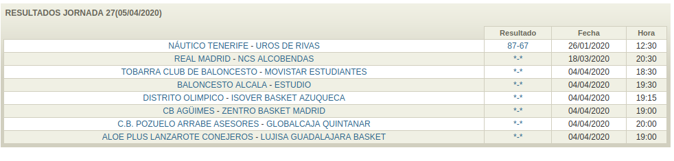
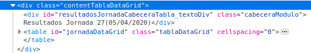

# basketscraping

Trying to webscrap the data of the Spanish Basketball Federation (FEB)

WEBPAGES TO SCRAP:

For data

http://competiciones.feb.es/estadisticas/Resultados.aspx?g=1&t=2019

http://baloncestoenvivo.feb.es/

For video

https://www.canalfeb.tv/

## Goal

The program pruebas.py webscraps a game and puts it in a directory called
JORNADAxx a file named called <name_of_the_team>.csv

## Example

#### 1. Get all the URLs to the games

See the image below, it is an example of the variable that in the
python code is called "results".

The html code of it (and the true value of the variable is):

We find every URL by searching for the tag \<a\> in HTML

#### 2.Get the stats from the table in a certain game

